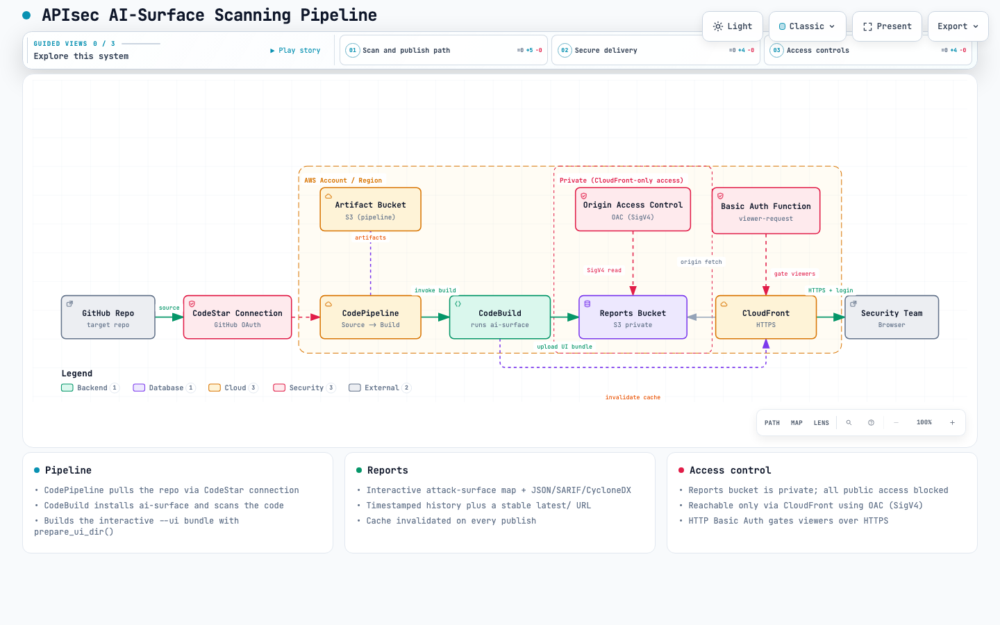

# APIsec AI-Surface scanning pipeline (AWS)

CloudFormation stack that runs [apisec-inc/AI-Surface](https://github.com/apisec-inc/AI-Surface)
against a target GitHub repository on AWS and publishes the resulting **web report**
to S3 so the security team can review the findings.

## How it works



For the **interactive** version (search, route tracing, themes, export), open
[`docs/diagrams/apisec-ai-surface-pipeline.html`](docs/diagrams/apisec-ai-surface-pipeline.html)
in a browser.

<sub>Generated with [Archify](https://github.com/tt-a1i/archify) from the typed source
[`docs/diagrams/apisec-ai-surface-pipeline.architecture.json`](docs/diagrams/apisec-ai-surface-pipeline.architecture.json).
Regenerate the HTML: `node archify/bin/archify.mjs deliver architecture docs/diagrams/apisec-ai-surface-pipeline.architecture.json docs/diagrams/apisec-ai-surface-pipeline.html --quality showcase`</sub>

```
GitHub repo ──(CodeStar connection)──▶ CodePipeline
                                          │
                                          ├─ Source stage: pull repo
                                          │
                                          └─ ScanAndPublish stage (CodeBuild):
                                                • pip install apisec-ai-surface
                                                • scan the repo
                                                • build the interactive UI bundle
                                                  (index.html + app.js + styles.css
                                                   + report.json + ai-bom.json)
                                                • upload to private S3 reports bucket
                                                • invalidate CloudFront cache
                                                        │
                                                        ▼
                              Private S3 bucket ◀──(OAC)── CloudFront (HTTPS) ──▶ Security team
```

- **CodePipeline** orchestrates the run. The Source stage pulls the target repo through
  an AWS **CodeStar/CodeConnections GitHub connection**; the ScanAndPublish stage invokes CodeBuild.
- **CodeBuild** installs `ai-surface`, scans the checked-out repo, and builds the same
  **interactive attack-surface map** that `ai-surface scan . --ui` serves locally — as a
  static bundle (`index.html`, `app.js`, `styles.css`, `report.json`, `ai-bom.json`) using
  the tool's own `prepare_ui_dir()`. It also writes SARIF and CycloneDX evidence alongside,
  then uploads everything to the reports S3 bucket.
- **S3** stores the interactive report in a **private** bucket (no public access, no website
  endpoint). The UI is pure client-side (it fetches `./report.json`), so no server is needed.
- **CloudFront** is the only way to reach the bucket, using **Origin Access Control (OAC)**.
  It serves over HTTPS, resolves folder URLs to `index.html` via a CloudFront Function, and
  is cache-invalidated on every publish so the newest report shows immediately.

### A note on CodeDeploy

You asked for CodePipeline, CodeBuild, **and** CodeDeploy. `ai-surface` is an offline
static-analysis scanner: it produces a report, it does not deploy a running application
to compute (EC2 / Lambda / ECS), which is what the **CodeDeploy service** exists for.
There is nothing to deploy to a deployment group in a scan-and-report flow, so wiring in
CodeDeploy would only add a no-op target.

The "deploy" in this pipeline is the **publication of the report to S3**, handled inside
CodeBuild. If you specifically need the CodeDeploy service for standardization/compliance
reasons (e.g. an S3-to-S3 CodeDeploy deployment group), let me know and it can be added as
a variant — but functionally it is not required here.

## Files

| File | Purpose |
|---|---|
| `template.yaml` | CloudFormation stack: buckets, IAM roles, CodeBuild, CodePipeline, connection. The build steps (install `ai-surface`, scan, build the interactive UI bundle, publish to S3) are **inlined** in the CodeBuild project, since the pipeline source is the scanned repo and would not contain a separate buildspec file. |

## Prerequisites

- AWS CLI configured with permissions to create IAM, S3, CodeBuild, CodePipeline, and CodeConnections resources.
- A GitHub account with access to the repositories you want to scan.

## Deploy

```bash
aws cloudformation deploy \
  --template-file template.yaml \
  --stack-name apisec-ai-surface \
  --capabilities CAPABILITY_NAMED_IAM \
  --parameter-overrides \
      ProjectName=apisec-ai-surface \
      RepoOwner=apisec-inc \
      RepoName=AI-Surface \
      RepoBranch=main \
      FullRepositoryId=apisec-inc/AI-Surface \
      FailOn=never \
      BasicAuthUsername=security \
      BasicAuthPassword='choose-a-strong-password'
```

`BasicAuthPassword` is required — the reports are gated behind HTTP Basic Auth at CloudFront,
so only someone with the username/password can view them. To rotate the credential, redeploy
the stack with a new value.

To also restrict access by source IP with WAF (deploy in `us-east-1`):

```bash
aws cloudformation deploy \
  --template-file template.yaml \
  --stack-name apisec-ai-surface \
  --region us-east-1 \
  --capabilities CAPABILITY_NAMED_IAM \
  --parameter-overrides \
      RepoOwner=apisec-inc RepoName=AI-Surface FullRepositoryId=apisec-inc/AI-Surface \
      BasicAuthPassword='choose-a-strong-password' \
      EnableWaf=true \
      AllowedCidrs='203.0.113.0/24,198.51.100.10/32'
```

### Authorize the GitHub connection (one-time)

If you did **not** pass an existing `ExistingConnectionArn`, the stack creates a new
connection in `PENDING` state. You must authorize it once:

1. Open the AWS console → **Developer Tools → Settings → Connections**.
2. Select the connection named `<ProjectName>-gh` and click **Update pending connection**.
3. Complete the GitHub OAuth/app authorization and grant access to the repos you want to scan.

Until this is done, the pipeline's Source stage cannot pull the repo. The connection ARN is
also shown in the stack's `ConnectionArn` output.

To reuse an already-authorized connection instead, pass its ARN:

```bash
--parameter-overrides ExistingConnectionArn=arn:aws:codeconnections:REGION:ACCOUNT:connection/xxxx ...
```

## Parameters

| Parameter | Default | Description |
|---|---|---|
| `ProjectName` | `apisec-ai-surface` | Name prefix for all resources. |
| `RepoOwner` | — | GitHub org/user that owns the repo to scan. |
| `RepoName` | — | Repository name to scan. |
| `RepoBranch` | `main` | Branch to scan. |
| `FullRepositoryId` | — | `owner/name` for the source action. |
| `ExistingConnectionArn` | `""` | Reuse an existing connection; blank creates a new one. |
| `FailOn` | `never` | `never` \| `high` \| `critical` — severity that fails the build. Keep `never` so the report always publishes. |
| `ReportRetentionDays` | `365` | Retention for timestamped report objects. |
| `BasicAuthUsername` | `security` | Username required to view reports through CloudFront. |
| `BasicAuthPassword` | — | Password required to view reports (min 8 chars, `NoEcho`). Required at deploy. |
| `EnableWaf` | `false` | Attach an AWS WAF web ACL to CloudFront (IP allowlist + rate limit). Requires deploying in `us-east-1`. |
| `AllowedCidrs` | `""` | Comma-separated IPv4 CIDRs allowed to reach reports (e.g. `203.0.113.0/24`). Empty = allow all IPs. Used only when `EnableWaf=true`. |
| `WafRateLimitPerFiveMin` | `2000` | Requests per IP per 5 min before WAF blocks. Used only when `EnableWaf=true`. |

## Run a scan

The pipeline runs automatically when the source branch changes. To run on demand:

```bash
aws codepipeline start-pipeline-execution --name apisec-ai-surface-pipeline
```

## Where the security team reads reports

After deploy, the stack outputs the report URLs:

```bash
aws cloudformation describe-stacks --stack-name apisec-ai-surface \
  --query "Stacks[0].Outputs" --output table
```

- **`ReportWebsiteUrl`** — the CloudFront base URL. Opening it with no path redirects
  straight to the latest report (a root `index.html` redirect is published on every run).
- **`LatestReportUrl`** — stable, bookmarkable CloudFront URL for the most recent scan
  (`/latest/index.html`).
- **`DistributionId`** — CloudFront distribution ID (used for cache invalidation).
- Every scan is also kept immutably under `reports/<owner>/<name>/<timestamp>/index.html`.

The report is the interactive attack-surface map (nodes grouped by category, risk badges,
governance mappings, and an AI-BOM download) — the same view as the local `--ui` server.
The raw `report.json`, `report.sarif`, and `ai-bom.cyclonedx.json` evidence sit next to it
for download and automation.

> The `ai-surface` UI shows an empty "scan a repo" form by default and only auto-loads the
> scan data when the URL carries `?demo`/`#demo` (locally it depends on a live `/api/scan`
> endpoint that does not exist on a static host). The build injects a small bootstrap into
> the published `index.html` that sets `#demo` before the app loads, so the hosted URL lands
> directly on the populated map. If you ever see the blank form, append `?demo` to the URL.

## Scanning multiple repositories

Each stack scans one repository. To scan several repos, deploy the stack once per repo with
a distinct `ProjectName`:

```bash
aws cloudformation deploy --template-file template.yaml \
  --stack-name ai-surface-service-a --capabilities CAPABILITY_NAMED_IAM \
  --parameter-overrides ProjectName=ai-surface-service-a \
      RepoOwner=my-org RepoName=service-a FullRepositoryId=my-org/service-a \
      ExistingConnectionArn=arn:aws:codeconnections:...:connection/xxxx
```

Reusing one authorized `ExistingConnectionArn` across stacks avoids re-authorizing GitHub
each time. (A multi-repo, single-pipeline matrix variant can be built if you prefer one stack
for many repos — ask and it can be added.)

## Security notes

- The reports bucket is **private** with all public access blocked. It is reachable **only
  through the CloudFront distribution** via Origin Access Control (OAC); the bucket policy
  allows `s3:GetObject` only for this distribution (scoped by `AWS:SourceArn`). The old
  `s3-website` endpoint no longer exists — use the CloudFront URL from the stack outputs.
- **Viewer access is gated by HTTP Basic Auth** enforced in a CloudFront Function on every
  viewer request: without the correct `BasicAuthUsername` / `BasicAuthPassword` the browser
  gets a `401` login prompt and no report is served. The credential is baked into the
  function at deploy time from the stack parameters (the password parameter is `NoEcho`).
  Because CloudFront forces HTTPS, credentials are not sent in the clear.
- Basic Auth is a single shared credential, not per-user identity. For individual logins,
  MFA, or SSO federation, front the distribution with Cognito + Lambda@Edge instead.
- **Optional WAF (`EnableWaf=true`)** adds an IP allowlist and a rate-based rule on the
  distribution. With `AllowedCidrs` set, the web ACL defaults to *block* and only the listed
  source IPs pass (and are still rate-limited) — a leaked Basic Auth password then can't be
  used from outside your network. With no CIDRs, it defaults to *allow* and only rate-limits.
  Because CloudFront-scoped WAF is global, **the stack must be deployed in `us-east-1` when
  `EnableWaf=true`**. The OAC only locks down S3-to-CloudFront, not viewer access.
- Each publish runs a CloudFront invalidation so the newest report is served immediately.
- The scanner runs offline: it executes no code from the target repo, makes no network calls,
  and needs no credentials for the target app.
- Buckets use `DeletionPolicy: Retain`; deleting the stack leaves the buckets (and reports) in place.
```
